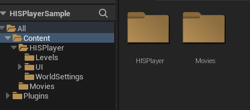
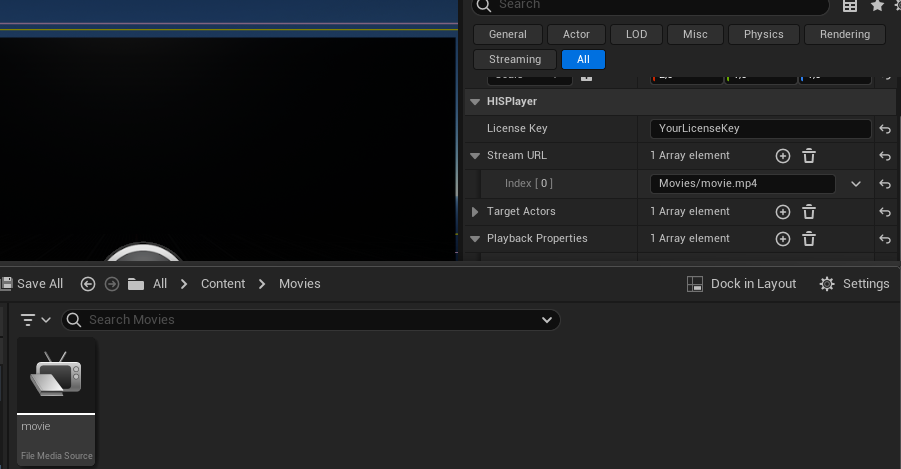

# Playing Local Files

HISPlayer macOS for Unreal supports playback of local video content using:

- **Absolute file paths** (from your Mac)
- **Project-relative paths** (from your Unreal project's `Content` folder)

---

## Using Absolute Paths (Mac Storage)

You can load video files directly from your Mac using the full absolute path.

Example: /Users/YourUser/Desktop/Videos/movie.mp4

To configure it:

1. Select **BP_HISPlayer** in the Level Outliner.  
2. Open the **Details** panel.  
3. Locate the **HISPlayer** section.  
4. Enter the full absolute file path into the **Stream URL** field.

---

## Using Project-Relative Paths (Content Folder)

You can also play video files stored inside your Unreal project.

### Step 1 – Create the Movies Folder

Inside your Unreal project:

1. Navigate to the main **Content** folder.  
2. Create a directory named: Movies

---

### Step 2 – Add the Video File

Place your video file inside: Content/Movies/

Example: Content/Movies/movie.mp4

To create the `.uasset` that Unreal can use, you must **drag and drop the .mp4 video file into the Unreal Editor's Movies folder**. Simply placing the file in the project directory is **not enough**. This ensures that Unreal generates the necessary `.uasset` for the engine to recognize the video.

---

### Step 3 – Set the Relative Path

In the **Stream URL** field of **BP_HISPlayer**, enter the path relative to the `Content` folder.

Example: Movies/movie.mp4

Do not include `Content/` in the path.

---

## Notes

- Forward slashes `/` must be used in paths.  
- Ensure the video format is supported (e.g., MP4, AVI).  
- If the video does not play, verify that the file exists physically inside the project directory.  
- Absolute paths on macOS typically start with `/Users/YourUser/...`.
