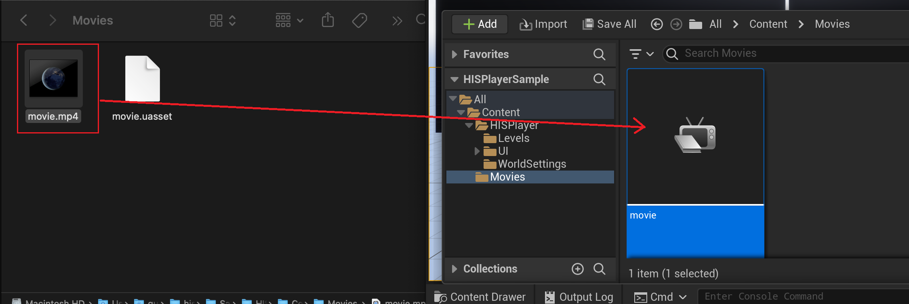
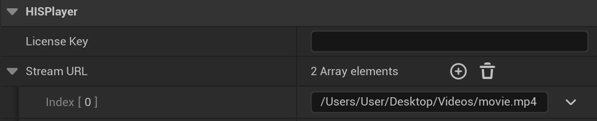

# Playing Local Files

HISPlayer Android for Unreal can play local content the device's storage. You can load the content from the **device's internal folders**, using the absolute path *(Ex: Downloads/movie.mp4)* or from the path relative to your **Content folder**, in case you have added the content into your project *(Ex: Movies/movie.mp4)*.

## Project videos
In order to add local content to your Unreal project, create a diretory named *Movies* inside the main *Content* folder of your project.

Then, in your **Mac file explorer**, add your video into that folder. Then, drag and drop the content into the editor's *Movies* folder, to create the *movie.uasset* element. It's very important that the content exists on the *Content/Movies* folder of your project, otherwise it might not copy to the device (just the uasset might not be enough):  

Then, add your video's relative path to your **Content**'s folder. In this example, will be *Movies/movie.mp4*:

## Device’s local videos
HISPlayer MacOs for Unreal can play local content using the absolute path. For example : **/Users/User/Desktop/Videos/movie.mp4** . 

Select the **HISPlayer_Blueprint** in the level outliner, go to the **Details** window and inside the **HISPlayer** section you can find the variable **Stream URL** that you will be able to customize. Please input the absolute path where the video file is located into the **Stream URL** field.

